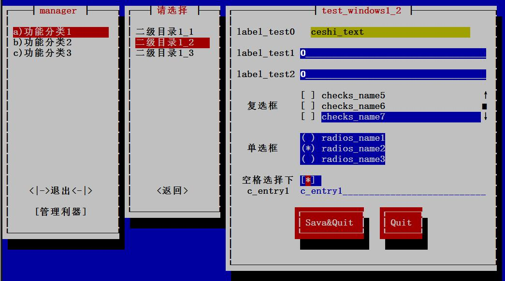

# py_menu

<!-- vim-markdown-toc GFM -->

* [1 背景和目标](#1-背景和目标)
    * [1.1 背景](#11-背景)
    * [1.2 目标](#12-目标)
* [2 名词解释](#2-名词解释)
* [3 假设和依赖](#3-假设和依赖)
    * [3.1 依赖](#31-依赖)
* [4 使用](#4-使用)
* [5 相关项目](#5-相关项目)
    * [5.1 类似项目](#51-类似项目)
    * [5.2 使用了 py_menu 的项目](#52-使用了-py_menu-的项目)
* [6 Version](#6-version)
* [7 参加步骤](#7-参加步骤)
* [8 小额捐款](#8-小额捐款)

<!-- vim-markdown-toc -->

更简单操作和使用的终端菜单及管理



## 1 背景和目标

### 1.1 背景

> * 平台可能会管理成千上万个实例，但什么来管理平台尼，需要有个程序来对特定平台的服务进行管理操作
> * 管理常用操作程序

### 1.2 目标

> * 框架与逻辑代码分离，备份代码时只需要备份主要逻辑代码即可

## 2 名词解释

> * newt: 全称是：Not Erik’s Windowing Toolkit, 用在 RatHat 的 Linux 发行版本 (RHEL, Fedora 和 CentOS) 的安装程序项目 Anaconda 中
> * snack: 官方 newt 库中还提供了 Python 封装库，名称为 snack
>   * [snack 前世今生](https://github.com/meetbill/py_menu/wiki)

## 3 假设和依赖

### 3.1 依赖

系统依赖: Centos 6.X 及以上 

## 4 使用

> * [py_menu 使用手册](docs/usage.md)


三层菜单点击确定后返回以下结果，是个 json

日志记录在 ./log/pymenu.log
```
yes {'entry_test2': '0', 'entry_test3': '127.0.0.1', 'entry_test1': '0', 'radios': 'radios2', 'checks_list': ['checks4']}
```
点击 cancel 时，输出 no

## 5 相关项目

### 5.1 类似项目
> * shell 终端菜单 --[shell_menu](https://github.com/meetbill/shell_menu.git)

### 5.2 使用了 py_menu 的项目
> * MegaCli 终端界面管理工具 [Megatui](https://github.com/meetbill/MegaTUI)

## 6 Version

* V1.2.3，2020-12-17 三级输出界面可接收参数，方便复用三级输出界面
* V1.2.2，2019-02-18 (1) 更改日志方式；(2) 添加 Centos6.x `_snackmodule.so`
* V1.2.1，2017-03-21 添加三级输出界面
* V1.2.0，2017-03-17 将三级配置界面独立出来为 three_page.py，可以单独调试此页面
* V1.1.1，2016-12-19 修复 bug，程序会保留二级菜单选项位置，假如从一级目录重新进入时，二级菜单选择位置没有报异常 bug
* V1.1.0，2016-09-30 更新 doc，同时重新更新程序结构，使得更方便编写程序
* V1.0.2，2016-09-29 添加日志，输出到 /var/log/menu_tool/acc.log 中
* V1.0.1，2016-09-25 First edit

## 7 参加步骤

* 在 GitHub 上 `fork` 到自己的仓库，然后 `clone` 到本地，并设置用户信息。
```
$ git clone https://github.com/meetbill/py_menu.git
$ cd py_menu
$ git config user.name "yourname"
$ git config user.email "your email"
```
* 修改代码后提交，并推送到自己的仓库。
```
$ #do some change on the content
$ git commit -am "Fix issue #1: change helo to hello"
$ git push
```
* 在 GitHub 网站上提交 pull request。
* 定期使用项目仓库内容更新自己仓库内容。
```
$ git remote add upstream https://github.com/meetbill/py_menu.git
$ git fetch upstream
$ git checkout master
$ git rebase upstream/master
$ git push -f origin master
```
## 8 小额捐款

如果你觉得 py_menu 对你有帮助，可以对作者进行小额捐款（支付宝）


